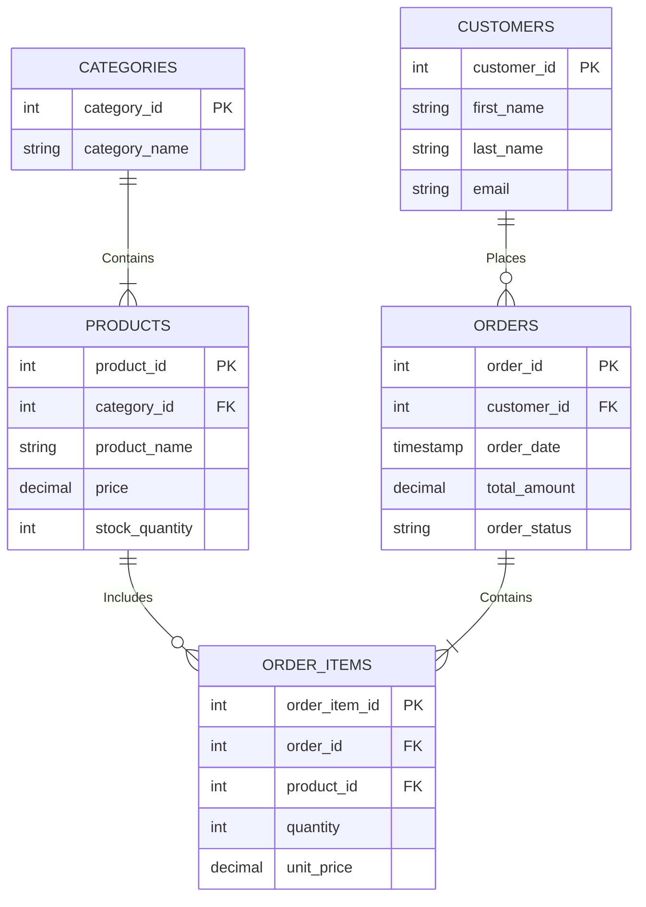

## Entity-Relationship (ER) Diagram
Below is the Entity-Relationship Diagram for the RanGo database:

```mermaid
erDiagram
    CUSTOMERS ||--o{ ORDERS : "Places"
    CATEGORIES ||--|{ PRODUCTS : "Contains"
    PRODUCTS ||--o{ ORDER_ITEMS : "Includes"
    ORDERS ||--|{ ORDER_ITEMS : "Contains"

    CUSTOMERS {
        int customer_id PK
        string first_name
        string last_name
        string email
    }
    CATEGORIES {
        int category_id PK
        string category_name
    }
    PRODUCTS {
        int product_id PK
        int category_id FK
        string product_name
        decimal price
        int stock_quantity
    }
    ORDERS {
        int order_id PK
        int customer_id FK
        timestamp order_date
        decimal total_amount
        string order_status
    }
    ORDER_ITEMS {
        int order_item_id PK
        int order_id FK
        int product_id FK
        int quantity
        decimal unit_price
    }
```
